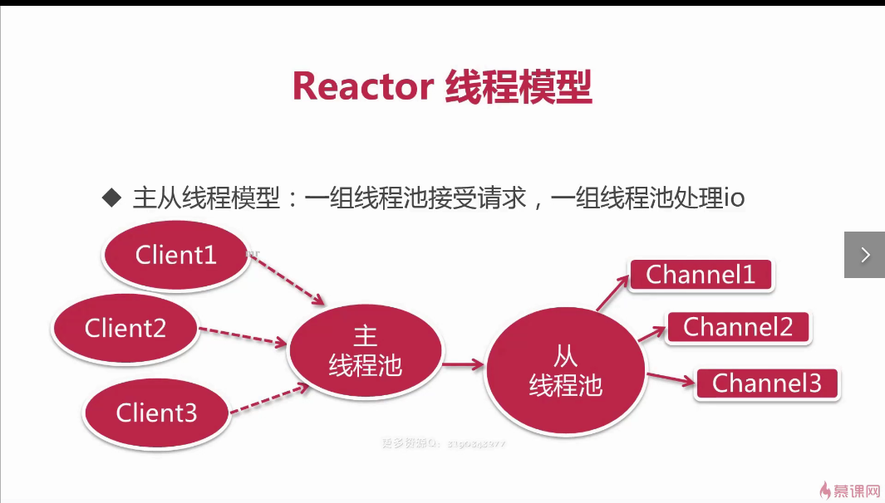

## 前言
Netty使用4版本，5版本因为性能不如4已经废弃了

### 初识netty

### 阻塞与非阻塞

### 同步与异步

### BIO

### NIO

### AIO

### 生活实例

### BIO,NIO,AIO

### 常见面试

### 再看Netty

### Reactor线程模型

## Hello Netty服务器
* 构建一对主从线程组
* 定义服务器启动类
* 为服务器设置Channel
* 设置处理主从线程池的助手类初始化器
* 监听启动和关闭服务器

## 备份
* https://coding.imooc.com/class/261.html
* https://www.cnblogs.com/ZHONGZHENHUA/p/9902028.html